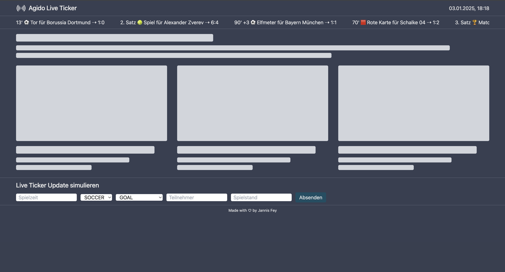

# Agido Live Ticker

Agido Live Ticker ist ein Projekt um der agido GmbH zu zeigen, was ich so drauf habe ;)

## How to start the app

Frontend starten:

```bash
npm run dev

or

npm run build && npm run start
```

Server Mock starten:

```bash
npm run server
```

Die App sollte unter [http://localhost:3000](http://localhost:3000) erreichbar sein.

Der Server sollte unter [http://localhost:4000/messages](http://localhost:4000/messages) ein paar initiale Messages
liefern.

## Aufbau

- Header
- Horizontaler Live-Ticker ([LiveTickerHorizontal.tsx](src/app/components/LiveTickerHorizontal.tsx))
- Dummy Content damit die Seite nicht so leer ist (z.B. Schlagzeilen, Bilder, Artikel usw...)
- Formular um neue Nachrichten zu
  erzeugen ([LiveTickerMessageSimulator.tsx](src/app/components/LiveTickerMessageSimulator.tsx))
- Footer



## Todo's

Dinge die ich aus Zeitgründen nicht mehr geschafft habe aber noch gerne machen würde:

- Mehr Tests
- Neuer Endpoint um Daten zu löschen
- Code besser strukturieren/auslagern/kommentieren
